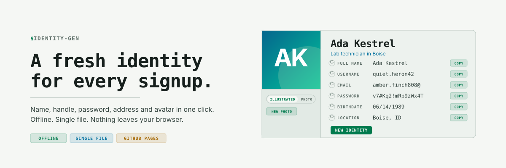

# identity-gen

<picture>
  <source media="(prefers-color-scheme: dark)" srcset="docs/cover-dark.svg">
  
</picture>

A single-page, offline generator for throwaway signup identities. One click
produces a name, username, email handle, password, birthdate, address,
occupation and an avatar, so no two of your accounts share the same details.

**Live:** https://real-fruit-snacks.github.io/identity-gen/

## Features

- Everything is generated in the browser. No server, no analytics, no
  network requests unless you opt into an online avatar style or photo mode.
- Reroll any single field, a whole section, or the entire identity.
- Click any value to edit it. Add custom fields and security questions only
  when a site asks for them; the question text is editable and the answer is
  generated for you.
- Username and email-handle rules (max length, separators, digits).
- Passwords default to passphrases (word count, separator, capitalisation,
  trailing number); switch to random characters with length and character
  class controls and look-alike avoidance.
- Avatar styles:
  - **People (offline):** Initials on a gradient, and Pixel, a 48x48
    pixel-art portrait generator with shaded forms, fifteen hair styles,
    hats, glasses, facial hair and fourteen character kits (knight, wizard,
    robot, astronaut, elf, vampire, royal, detective, punk, pirate, ninja,
    chef, alien, cat). A slider sets how often kits appear.
  - **Abstract (offline):** Marble, Bauhaus, Sunset, Terrain, Rings, Bloom.
  - **Illustrated (needs internet):** DiceBear's Lorelei, Notionists and
    Open Peeps, loaded from a CDN only when selected.
  - **Photo:** a face from an external image source, if you choose one.
- Save any generated avatar as a 512px PNG or copy it to the clipboard.
- Export as plain text, Markdown or JSON, or download `.txt` / `.md`,
  ready to paste into a password manager. Exports include the site, notes
  and seed.
- Seeds: every identity shows a seed that reproduces it and its avatar.
- Names, usernames and handles already generated on your device are
  remembered so new identities never repeat them.
- The current identity survives a refresh. Undo steps back through the
  last ten, and a Recent identities panel lets you restore any of them
  directly.
- Keyboard shortcuts: `N` new identity, `P` new photo, `U` undo.
- Installable as an app: on a phone or desktop browser, choose "Add to
  Home Screen" or "Install". A service worker keeps it working offline.
- Automatic, light or dark theme (header toggle), styled with the
  [Terminal Workbench](https://github.com/Real-Fruit-Snacks/terminal-workbench-suite)
  design tokens.

## Usage

Open `index.html` in any modern browser, or use the hosted copy above.
Nothing needs to be installed or built. The hosted copy can be installed as
an app from the browser menu.

The email field is a handle only (the part before the @), so you can pair it
with your own alias service or domain, or paste it into a password manager
that adds the domain itself.

## Privacy

The page makes no network requests by default. Three optional features do:

- **Illustrated avatars** load the DiceBear library from jsDelivr when you
  select one of those styles. If the library cannot be loaded, the page
  shows the Initials avatar instead.
- **Photo mode** fetches a face from the configured image source.
- Nothing else. The People and Abstract avatar styles are drawn entirely in
  the page.

All state (settings, current identity, undo history, used-name memory)
lives in your browser's local storage. The "Stored on this device" panel
lists exactly what is kept and has a reset button that clears it.

## Intended use

This is for ordinary sites that ask for more personal detail than they
need. Do not use generated details where you are required to give accurate
information, such as financial, government, medical or employment services.

## Development

The page is a single file with no build step. Browser checks live in
`tests/test_page.py` and run on every push through GitHub Actions:

```
pip install playwright
playwright install chromium
python tests/test_page.py
```

`sw.js` caches the page for offline use. Bump the `CACHE` name in it when
you ship a change you want installed copies to pick up immediately.

## Credits

- Design tokens: [Terminal Workbench Suite](https://github.com/Real-Fruit-Snacks/terminal-workbench-suite) (MIT)
- Illustrated avatars: [DiceBear](https://www.dicebear.com) Lorelei, Notionists and Open Peeps styles (CC0, no attribution required)

## License

MIT. See [LICENSE](LICENSE).
